# workshop-task-4
# Interactivity
Link to my completed website (https://glovving.github.io/workshop-task-4/)
## The goals for this weeks workshop tasks:
- Create an interactive p5.js sketch with at least three different kinds of user input events.
- Experiment with ways to record and redeploy inputs from the user.
- Make a new repository for your p5.js project on your GitHub account, publish your sketch as a webpage, and include a README file in your repository with a URL to the webpage along with documentation of your work.

## Notes and Planning
Here are the notes I took during the workshop tutorial video, I used them as a quick referencing while writing my code

For planning my sketch, I began with writing down a basic idea of what I wanted which is shown below.

My initial plan was to have an angel character which would personally address the user, asking for some personal input (names, message, etc.), then the angel would quiz the user, depending on the results of this quiz the user would end up with different 'end' scenarios.
I wanted this sketch to feel videogame-like, by using an illustrated character, presenting the user a challenge, and having multiple endings based on user input.

## Creating my Sketch
I began working on this sketch by creating my angel character, which I made using simple shapes and the pen tool on paint 3d, which is a free windows program.

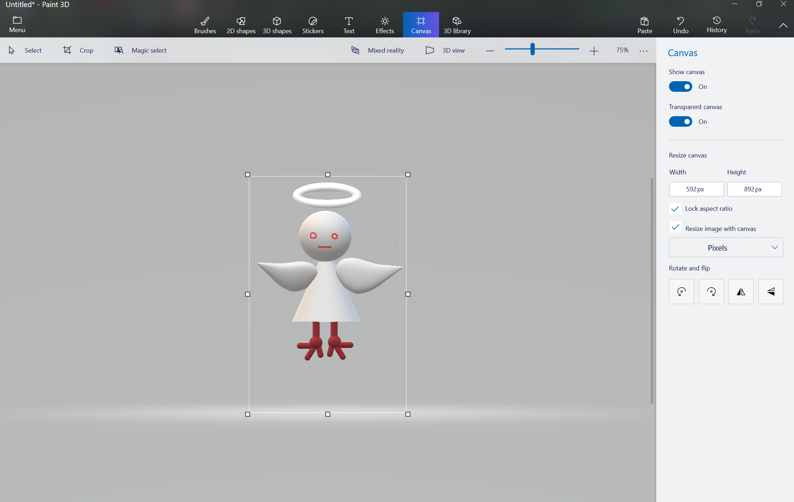

I chose to create my image using a digital program in order to emphasise the digital environment of my sketch.

### Code Layout
The layout of my code is very similar to last weeks workshop, I globally declared my variables such as buttons, images, arrays etc., used a preload function to load images/ music from my resources library, a set up function to code the behaviour of my globally declared elements and several functions corresponding to different 'scenarios' which are triggered using a series of if + else statements and boolean flags in my draw function.

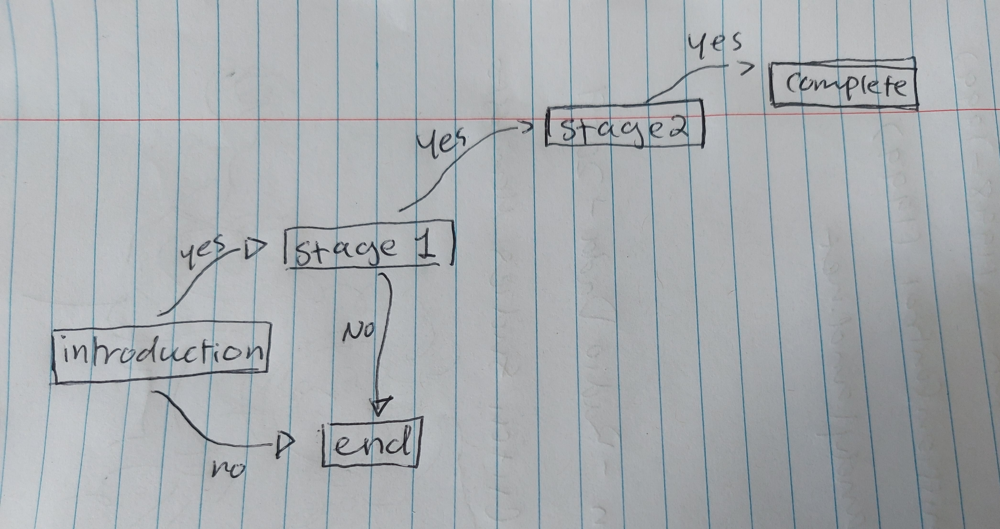

The user is greeted with the introduction screen which gives the user the option to continue or quit using 'yes' and 'no' buttons, upon pressing 'no', the end function is triggered and upon pressing yes the continue1 function is triggered.
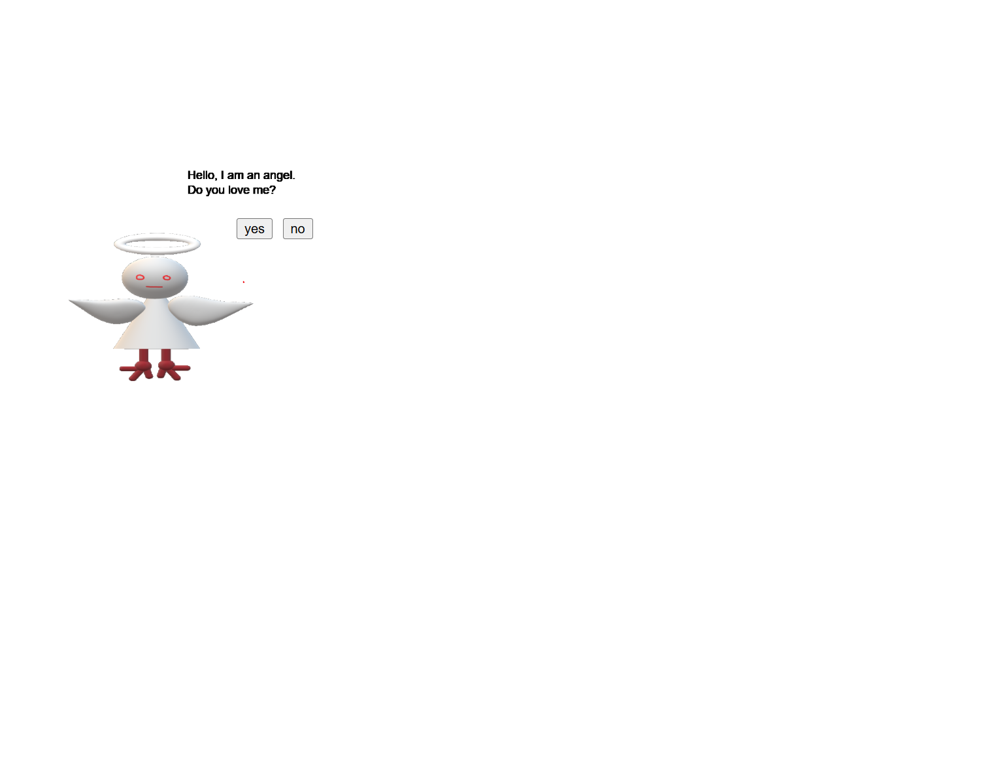

The end scenario is a mostly blank, cream screen with small, randomly generated pictures of monkeys, and the text "Please come back when you have more love.", for this screen, I used the same flow and logic as my collage from workshop 3.

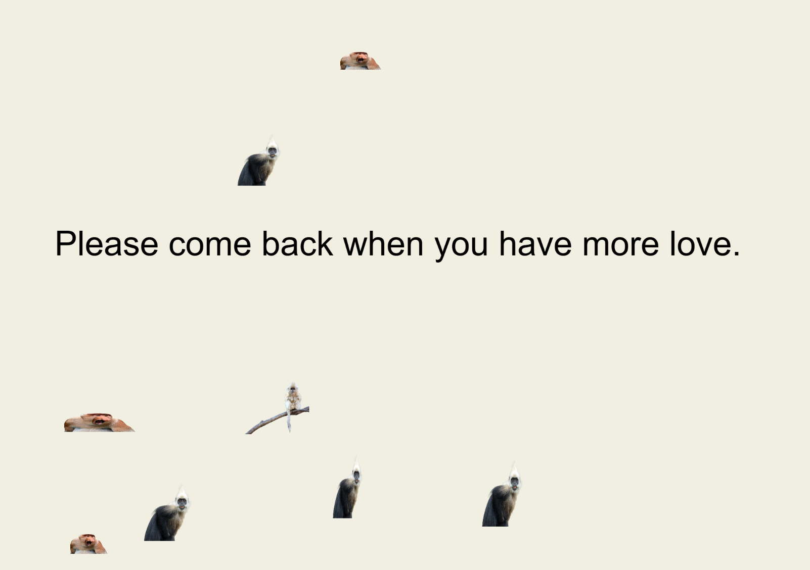

I used the google rgb value selector for the background of this screen, and every other time I had to select a colour.

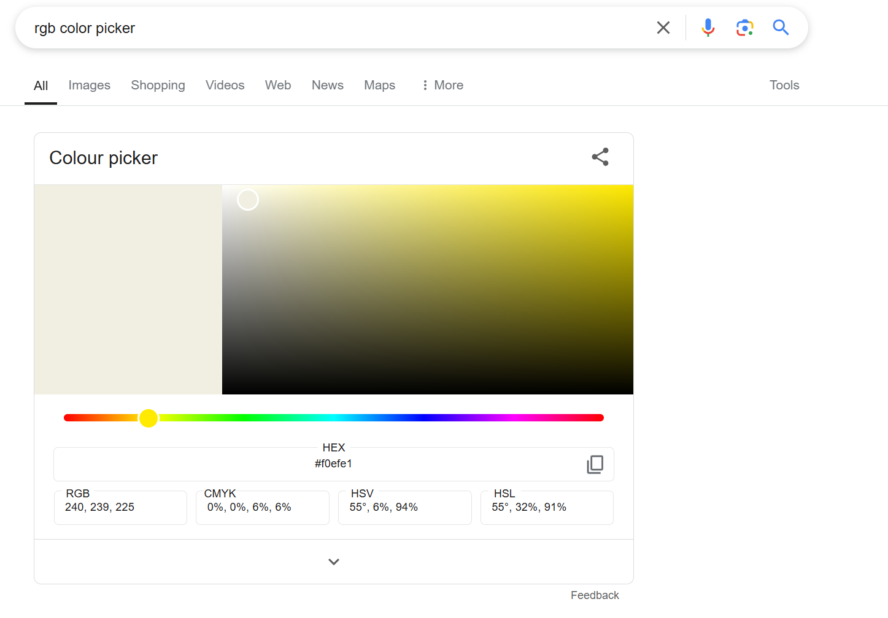

The continue1 scenario is a 'quiz', where the user is able to check traits that apply to themselves and submit their answer.

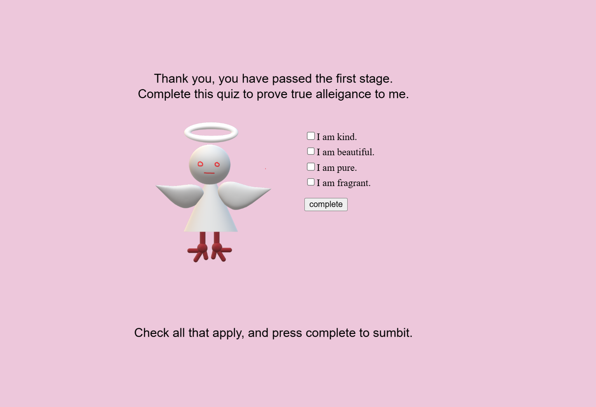

Pressing the submit button toggles a boolean flag variable, which then triggers a function which calculates the users score, and depending on the score toggles another boolean flag depending on whether or not the used has 'passed'.

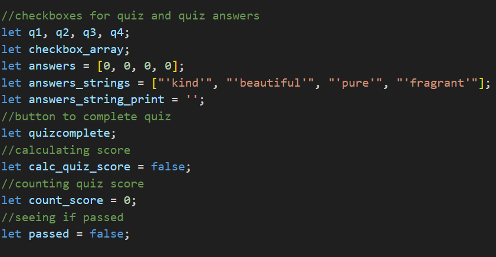
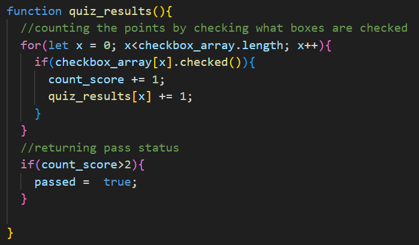

When 'passed' (shown above) is passed as true, the draw function triggers the success1 function.

If the user has failed, the end scenario is triggered again.

When the user is at the success1 function they are asked for their name, the screen has a typing box and a button, once the user has typed their name and clicked the submit button a boolean flag is toggled, and the user is sent to the final screen.

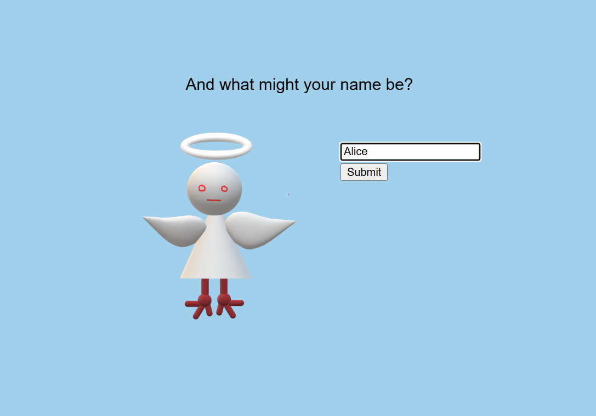

At the final scenario the user is referred to by their inputted name and welcomed into heaven, their selected list of qualities from the quiz are listed on the screen. 

In order to store and display the users selected qualities from the checkboxes I wrote a qualities() function, which uses a for loop to traverse through the check box array, and using the index number, I referred to a corresponding string array, concatenating the checked quality strings to a blank string which was then displayed at the final screen.

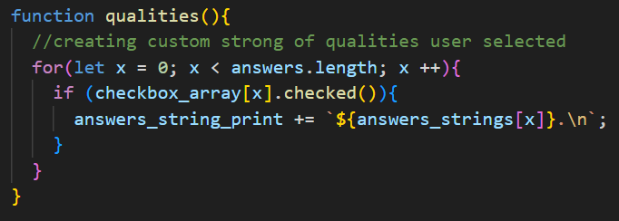

## Problems I Encoutered, Failed Experiment, and What I would do Differently

### Problem One:
Similarly to last week the biggest problem I encountered was the placement of my variables and code.
My initial 'yes' and 'no' buttons were not responding like I wanted to to, so I went to the discord to ask for help, where Leo helped my fix my code.
Aside from not globally declaring my variables he also advised me to use the .hide() and .show() functions to hide and show different elements when I needed them on screen. 

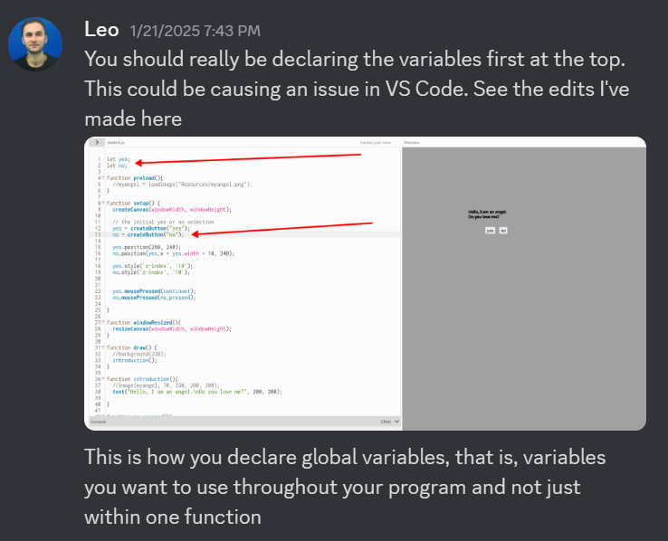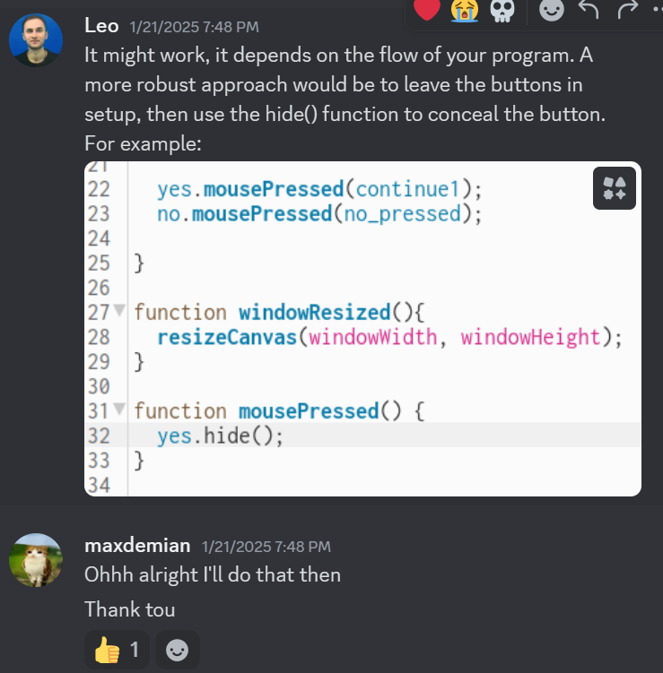

I also made functions which would traverse through and array, hiding and showing all elements.

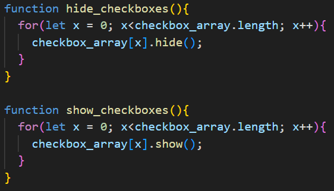

### Problem Two
I did experiment with resizing capabilities, however I did not keep track of this thoroughly which resulted in my screen being cut or not loading correctly when the window was resized.
I will fix this in my next website by always using the window width/ height as a reference. 

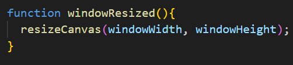

### Failed Experiment:
Another big problem I encountered was when I tried to add music to my website, I felt like I did everything right as the song did play, however the sound was very glitched and laggy so it did not sound nice and I ended up removing the song from my website.

I tried several different solutions to try and get the song to work, first I changed the mp3 file to a lower sound quality, then I changed it to a obb file for an even lower file size, and finally I tried using a check function so that the song would only play once it had fullt loaded to prevent glitching, however none of these soltions worked.
(sc)

### What I would do Differently:
Something I want to do differently for the next workshop is to limit my reliance on if/ else statements within my draw function.
(Add screen shot)
I ended up using so many if/else statements, each time callin and individual function, when I should have been calling functions within functions where possible.
I want to improve on this aspect as I feel like my code is not as robust as it could be and overly long.

  
